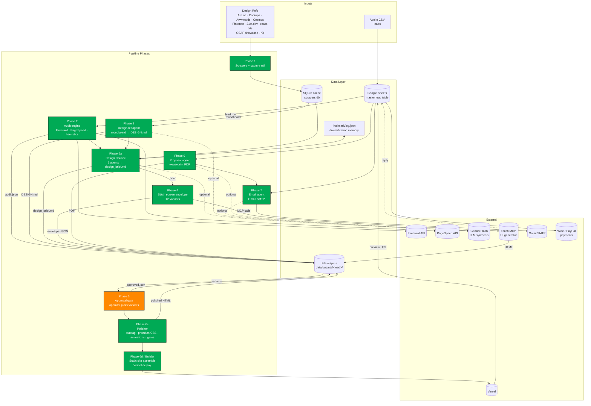
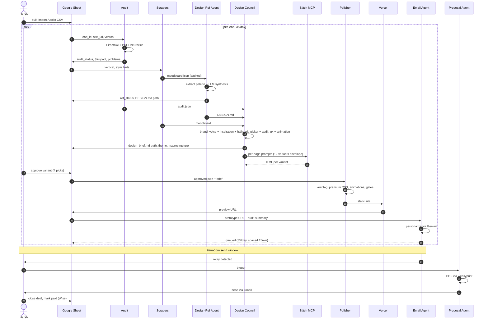
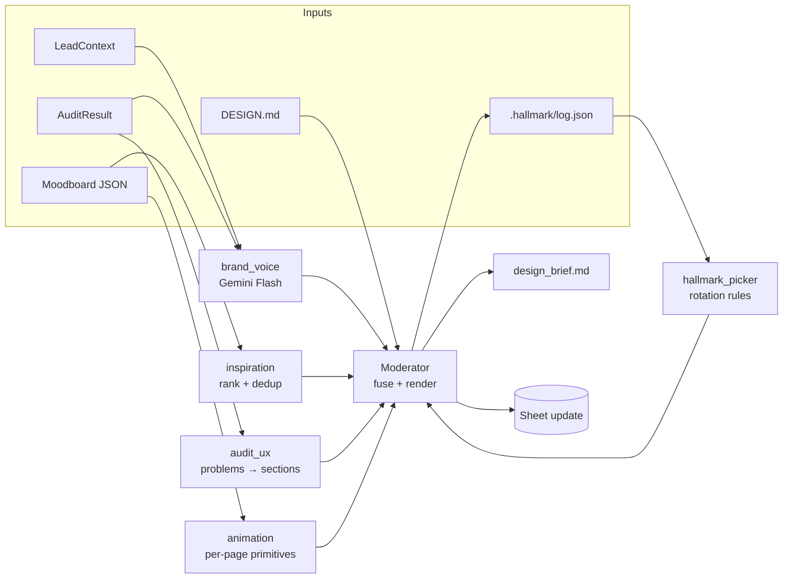
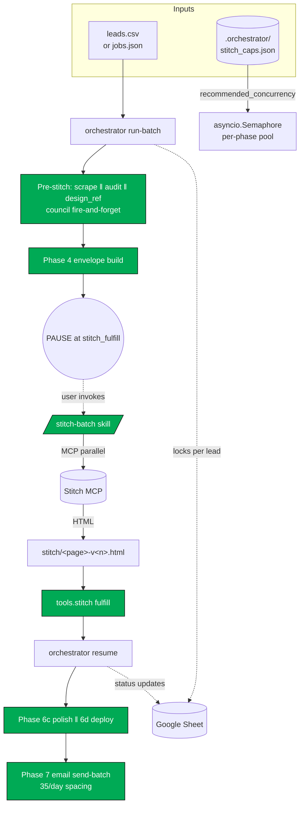
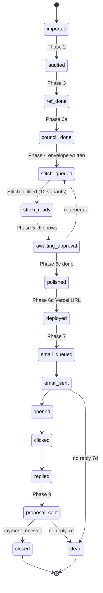

# System Architecture

End-to-end design of the Website Generator pipeline. Mermaid diagrams + component rationale.

---

## 1. High-Level System Map



Green = built. Orange = remaining.

---

## 2. Per-Lead Sequence



---

## 3. Component Rationale

| Component | Why it exists | Replaces / Avoids |
|---|---|---|
| **Apollo CSV import** | Single source of US local-business leads w/ contact + site URL | Manual prospecting |
| **Google Sheets master** | Free, scriptable, operator-readable single source of truth for lead status | CRM cost + complexity |
| **SQLite scrapers.db** | Local cache for moodboard refs → don't re-burn Firecrawl/Are.na quotas | Repeated API hits |
| **Phase 1 scrapers (10 sources)** | Curated design references (static + motion) per vertical/style → drives Hallmark theme picks + Stitch prompts | LLM hallucinating "modern design" with no grounding |
| **`_capture.py` Playwright util** | Records 10s scroll video + detects animation libs on live sites → tells us *how* refs animate, not just *what* they look like | Static screenshots that lose motion signal |
| **Firecrawl audit** | Real markdown + HTML + screenshot of target site → ground truth for heuristics | Naive `requests.get` (misses JS-rendered content) |
| **PageSpeed Insights** | Authoritative Core Web Vitals + perf score → $ impact estimates land harder | Manual perf testing |
| **Heuristics** | Detect missing CTA, phone, schema, mobile meta, etc. → translates to "what's broken" for outreach copy | Pure LLM critique (slow + flaky) |
| **$ impact translator** | Convert tech problems to monthly revenue loss per vertical → makes the cold email subject line punch | Generic "your site is slow" pitches |
| **DESIGN.md (Phase 3)** | Locked design system per moodboard + vertical → Stitch + Hallmark + polisher all agree on tokens | Each layer reinventing palette/fonts |
| **Design Council (Phase 6a)** | Fuses 5 specialist agents (brand voice, inspiration ranking, Hallmark diversification, audit-driven UX, motion plan) into a single Hallmark-compatible brief → strategic direction *before* expensive Stitch calls | Stitch generating 12 generic variants that polisher can't save |
| **Hallmark theme picker** | Enforces structural variety across leads (no 200 identical sites) by rotating macrostructure + theme per `.hallmark/log.json` | Default-attractor sameness |
| **Stitch MCP (Phase 4/6b)** | Generates baseline HTML quickly from a structured prompt → cheap rough draft per page | Hand-coding every prototype |
| **Approval gate (Phase 5)** | Operator picks best variant per page → quality gate before deploy + spend | Auto-shipping mediocre variants |
| **Polisher (Phase 6c)** | Autotags animation primitives, injects Lenis/GSAP/Splitting wiring, premium CSS layer, mobile fixes, honest-copy scan, slop gates → turns Stitch baseline into production-ready immersive site | Shipping naked Stitch HTML (looks AI-generated) |
| **Static multi-page build + Vercel** | Free hosting, per-lead subdomain (`<biz>.vercel.app`), instant CDN deploy | Owning hosting, paying for domains |
| **Email agent + Gmail SMTP** | 35/day personalized cold outreach w/ audit + preview link embedded | Generic templates, low reply rate |
| **Reply detection** | Watch Gmail → flip Sheet status → trigger proposal flow | Manual inbox triage |
| **Proposal PDF (Phase 9)** | Branded 1-page PDF w/ audit, prototype URL, scope, $ → closes faster | Plain-text quotes |
| **Wise / PayPal / wire** | India-friendly USD payment paths | Stripe (unavailable in IN) |

---

## 4. Council Internals (Phase 6a)



Each agent is deterministic unless marked LLM. Council emits one brief; downstream phases consume it.

---

## 4b. Orchestrator (Phase 10)



**Per-phase concurrency caps** (defaults; Stitch overridden by probe):
- scrape / audit / design_ref / council / polish = **10**
- build (Vercel CLI) = **5**
- stitch_fulfill = **3** (probed)
- email = **1** (rate-limited)

**Pause/resume boundary** sits at MCP. Python orchestrator can't dispatch `mcp__stitch__*` directly, so it writes envelopes and exits. The `/stitch-batch` skill drives parallel MCP calls inside the CC session, then user runs `orchestrator resume` to drive polish + deploy + (optional) email send.

---

## 5. Polisher Pipeline (Phase 6c)

```mermaid
flowchart TB
  In[Stitch HTML<br/>+ design_brief.md<br/>+ DESIGN.md] --> Parse[BeautifulSoup parse]
  Parse --> Auto[_autotag<br/>data-reveal/split/magnetic/marquee/parallax]
  Auto --> CSS[_premium_css<br/>OKLCH tokens + 2+1 fonts + focus ring +<br/>mobile-correct base + intro loader]
  CSS --> Wire[_animation_wire<br/>Lenis + GSAP + ScrollTrigger + Splitting CDN +<br/>prototype.js w/ prefers-reduced-motion]
  Wire --> Mobile[_mobile_fix<br/>viewport + grid + button-text checks]
  Mobile --> Honest[_honest_copy<br/>scan for invented metrics]
  Honest --> Slop[_slop_gates<br/>fake chrome + missing focus-visible]
  Slop --> Out[site/&lt;page&gt;.html<br/>+ assets/prototype.{js,css}<br/>+ vercel.json<br/>+ polish_report.json]
```

---

## 6. State Lifecycle (per lead, in Sheet)



---

## 7. Data Locations

```
/data
  /leads/                          Apollo CSV exports (gitignored)
  /cache/
    scrapers.db                    SQLite ref cache
    refs/<source>/<slug>/          Captured artifacts
      preview.mp4
      thumbnail.jpg
      meta.json
      components.tsx               (21st.dev, react-bits only)
  /outputs/<lead_id>/              Per-lead artifacts
    audit.json                     Phase 2 audit
    screenshot.png                 Site screenshot
    moodboard.json                 Phase 1 unified output
    DESIGN.md                      Phase 3 system
    stitch_request.json            Phase 3 envelope (design system creation)
    stitch_design_system.json      Phase 3 result (ds_id)
    stitch_screens_request.json    Phase 4 envelope (12 variants)
    stitch/<page>-v<idx>.{html,png}  Phase 4 Stitch outputs
    design_brief.md                Phase 6a council brief
    approved.json                  Phase 5 operator picks
    site/                          Phase 6c polished output
      index.html services.html about.html contact.html
      assets/prototype.js prototype.css
      vercel.json
    polish_report.json             Phase 6c PolishResult
    proposal.pdf                   Phase 9
.hallmark/log.json                 Council diversification memory
```

---

## 8. Cost / Quota Map

| External | Budget | Per-lead cost | Constraint |
|---|---|---|---|
| Firecrawl | 1000 credits free | 1 scrape | ~1000 leads/quota |
| PageSpeed | unlimited (key) | 1 call mobile | rate-limited 25k/day |
| Are.na API | unlimited | cached | OK |
| Gemini Flash | 1500 req/day free | 2-4 calls (council + email + proposal) | ~375 leads/day cap (well above 35) |
| Stitch MCP | session-scoped | 1 design system + 4-12 screens | ~3-5 min/screen latency |
| Gmail SMTP | 35/day chosen cap | 1 send (+ 1 follow-up) | personal Gmail; ~500/day hard limit |
| Vercel | free tier | 1 project/lead | ~unlimited projects |
| Total | $0 | $0 | dominated by Stitch + Gmail rate limit |

---

## 9. Failure Modes + Mitigations

| Failure | Mitigation |
|---|---|
| Firecrawl quota exhausted | Sheet error_log; fall back to plain `requests` + BS4 (less reliable but free) |
| Stitch generation timeout | Detected by orchestrator (10x poll); marks variant `failed`, council picks alt direction |
| Scraper anti-bot wins (Pinterest/Cosmos/Awwwards/21st/react-bits/gsap) | Graceful empty result; **currently only Are.na + Codrops + r3f return data**. Council falls back to what's available; design-ref agent ends up palette-poor. **Mitigation pending: add Unsplash/Pexels/Behance RSS/Dribbble RSS as image-heavy fallback sources, plus vertical→query map** |
| r3f-examples flooding moodboard for non-3D verticals | r3f returns generic CodeSandbox titles that derail color extraction (cosmic purple for wine brand). Workaround today: `--source-only arena` for non-3D verticals. Proper fix: per-vertical source weighting |
| Gmail flagged as spam | 7-day warmup ramp; spaced sends; plain text body |
| Vercel deploy fails | error_log; retry once; mark lead `deploy_failed` |
| Stitch HTML has fake UI chrome | Polisher `_slop_gates` flags; operator reviews before deploy |
| Invented metrics in copy | Polisher `_honest_copy` flags; operator strips before send |
| Hallmark theme repeats | `.hallmark/log.json` rotation enforced in `hallmark_picker.py` |
| Reply detection misses | Operator manually flips Sheet status |

---

## 10. Build Status

| Phase | Module | Status | Commit |
|---|---|---|---|
| 0 | scaffold | ✅ | `69b9ce9` + `814a93e` |
| 1 | scrapers (13 sources + cli + capture) | ⚠️ partial — 4 working (arena/codrops/unsplash/pexels); 9 blocked by anti-bot or sparse | `1883efe` |
| 15 | NLP keywords (spaCy + KeyBERT + 2 LLM calls) | ✅ | - |
| 2 | audit engine | ✅ | `601577c` + `fcdb7f4` |
| 3 | design-ref → DESIGN.md + Stitch envelope | ✅ | `bfc50c8` |
| 4 | Stitch screens envelope (12 variants) | ✅ | `1dbb61f` |
| 5 | approval gate (Flask UI) | ✅ | - |
| 6a | design council | ✅ | `a4935e8` |
| 6b | Stitch fulfillment | ✅ via `.claude/skills/stitch-batch/` | - |
| 6c | polisher | ✅ | `9d7061a` |
| 6d | static build + Vercel deploy | ✅ | `90db03a` |
| 7 | email agent (template + LLM polish + Gmail SMTP) | ✅ | - |
| 8 | Sheets layer | ✅ | `1dca023` |
| 9 | proposal + audit PDFs (Playwright Chromium) | ✅ — reply detection still TODO | - |
| 10 | orchestrator (async worker pool, semaphores per phase) | ✅ | - |
| 11 | end-to-end test (20 leads) | ⏳ | - |

---

## 11. Why This Architecture, Not Simpler

**Why not "just use Stitch end-to-end"?**
- Stitch alone produces generic, slop-y UI. Finish is poor.
- No design memory → 200 leads = 200 same-looking sites.
- No animation discipline → looks AI-generated.
- The Council (pre-Stitch strategy) + Polisher (post-Stitch finish) sandwich is what makes the output sellable at $800-$1,200.

**Why not "just use Hallmark end-to-end"?**
- Hallmark is a skill (LLM-driven). Single-call. Token-expensive at 35/day × 4 pages × 200/mo.
- Less programmatic control over per-page section structure.
- Stitch gives us a deterministic baseline to polish.

**Why not "skip the audit, just send templates"?**
- Audit + $ impact in the email is what gets the reply. Without it, the message reads as another agency cold pitch.

**Why static HTML, not Next.js?**
- All animations (Lenis, GSAP, ScrollTrigger, Splitting) work in vanilla via CDN.
- No build step, no JSX porting, no React runtime cost.
- Deploys in seconds to Vercel.
- Identical end-user experience.

**Why Google Sheets, not ClickUp/Notion/Airtable?**
- Free, instant, scriptable via service account.
- Single-operator scope doesn't need richer tooling.
- Can migrate later if volume justifies.

**Why Gmail, not domain + Smartlead/Instantly?**
- Constraint: no spend until first revenue.
- 35/day cap is matched to Gmail safety, not the ceiling.
- Domain + warmed inboxes added after first close.
